# python

## 基础知识及使用技巧

### python中文编码

解决办法是在文件头添加：

```python
# coding=utf-8
```

### 多行语句

我们使用斜杠(\)将一行的语句分为多行显示

```python
total = item_one + \
		item_two + \
		item_three
```

语句中包含[],{}或()括号就不需要使用多行连接符

```python
days = ['Monday','Tuesday','Wednesday',
'Thursday','Friday']
```

### 用户输入

使用input进行用户输入

```python
name = input("请输入您的姓名：")
print(name)
```

### 命令行参数

使用sys的sys.argv来获取命令行参数，如命令行为

```python
python test.py arg1 arg2 arg3
```

那么sys.argv为

```
['test.py', 'arg1', 'arg2', 'arg3']
```

## Anaconda & pycharm

使用Anaconda Prompt进行环境的切换，使用pycharm创建运行环境。

### Anaconda Prompt查看所有的运行环境

```python
conda info -e
```

### Anaconda Prompt激活某一个运行环境

```python
activate Aol
```

### 使用pycharm创建运行环境

setting–>project–>project interpreter

### 使用豆瓣加速pip安装

```python
pip install sklearn  -i http://pypi.douban.com/simple/ --trusted-host pypi.douban.com
```

## 网络编程和多任务

## 数据库

## django

### 创建项目

```python
django-admin startproject test1
```


__init__.py:说明test1是一个python包

settings.py:项目的配置文件

urls.py:进行url路由的配置

wsgi.py:遵循wsgi协议框架，web服务器网关接口，主要针对http风格的请求响应模型做的设计。但不支持websocket。

asgi.py:异步网关协议接口，能够支持http和websocket。

manage.py:整个项目的管理文件。

### 创建功能模块和应用

Django开发中，一个功能模块用一个应用来实现

创建应用：

```python
python manage.py startapp booktest
```


init.py说明目录是一个python模块。

models.py:写和数据库相关的内容。

views.py:定义视图函数。

tests.py:写测试代码的文件。

admin.py:和网站的后台管理相关的文件。

### 注册应用到项目

在项目文件夹test1中settings.py的INSTALLED_APPS变量里注册booktest：


### 启动项目

```python
python manage.py runserver
```

### ORM

缩写Object、Relation、Mapping，描述对象类和数据库中的表之间的映射关系。

### 模型类和表的设计

在**应用**的models.py中设计ORM。例如：

```python
from django.db import models

# Create your models here.
class BookInfo(models.Model):
    #图书名称
    btitle = models.CharField(max_length=20)
    #图书的出版日期
    bpub_date = models.DateField()
```

生成迁移文件，在项目目录下执行

```python
python manage.py makemigrations
```

执行迁移生成数据库表，在项目目录下执行

```python
python manage.py migrate
```

Django默认使用sqlite数据库，在项目文件夹settings里面设置，支持绝大多数数据库。

### 通过模型类操作数据表

django shell可以来实现模型类操作数据表

```python
python manage.py shell
```

创建实例，增加数据，在shell中依次执行

```python
from booktest.models import BookInfo
b = BookInfo()
b.btitle = "天龙八部"
from datetime import date
b.bpub_date = date(1990,1,1)
b.save()
```

执行完毕之后会在数据表中插入“天龙八部”的记录。

查询数据表中的数据，在shell中执行

```python
#查询id=1的记录
br = BookInfo.object.get(id=1)
#输出 booktest.models.BookInfo
type(br)
#输出id=1记录的title
br.btitle
```

修改记录，重新赋值，然后save()

```python
br.bpub_date = date(1991,10,10)
#重新保存
br.save()
```

删除数据，delete()

```python
br.delete()
```

## flask

## tornado

## scrapy

## 数据分析

## 机器学习

## 深度学习

### 感知机

有n个输入数据，通过权重与各数据之间的计算和，比较阈值判断，得出输出。

```python
y = w1x1+w2x2+w3x3+w4x4...+wnxn
```

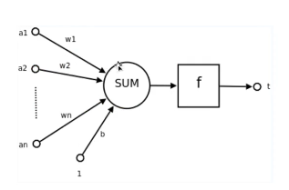

[理解感知机的案例](http://playground.tensorflow.org/)>>

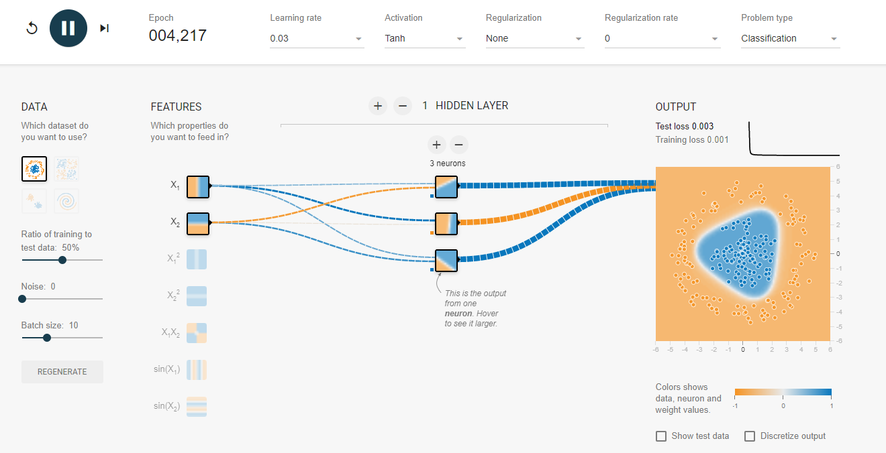

感知机和逻辑回归的区别:

逻辑回归通过激活函数，感知机通过阈值判断

### 神经网络

定义：在机器学习和认知科学领域，人工神经网络(artificial neural network 缩写ANN),简称神经网络(neural network，缩写NN)或类神经网络，是一种模仿生物神经网络的结构和功能的计算模型，用于对函数进行估计或近似。

基础神经网络：单层感知器，线性神经网络，BP神经网络，Hopfield神经网络等

进阶神经网络：玻尔兹曼机，受限玻尔兹曼机，递归神经网络等

深度神经网络：深度置信网络，卷积神经网络，循环神经网络，LSTM网络等。

英国学者：辛顿，神经网络之父。

神经网络的结构:

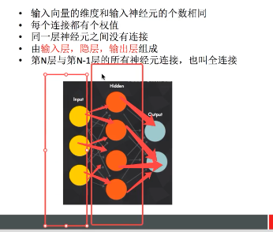

组成：

结构(Architecture)，例如神经网络中的权重，神经元等等

激活函数(Acticity Rule)

学习规则(Learning Rule)学习规则指定了网络中的权重如何随着时间推进而调整(反向传播算法)

### 神经网络分类

目的：判断某一个样本属于全部类别的每一个概率，然后得到概率最大项。例如

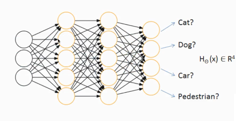

在使用tensorflow时候，tf.nn,tf.layers,tf.contrib模块有很多功能有重复的。下面是对三个模块的简述：

(1)tf.nn:提供神经网络相关操作的支持，包括卷积操作(conv)、池化操作(pooling)、归一化、loss、分类操作、embedding、RNN、Evalution。

(2)tf.layers:主要提供高层的神经网络，主要和卷积相关的，对tf.nn的进一步封装。

(3)tf.contrib:tf.contrib.layers提供够将计算图的网络层、正则化、摘要操作，是构建计算图的高级操作，但是tf.contrib包不稳定以及一些实验代码。

案例：浅层人工神经网络模型SoftMax

图像(28*28)->共有784个特征点—>输入->判断属于0-9的概率—>找出最大概率值。softMax如下:

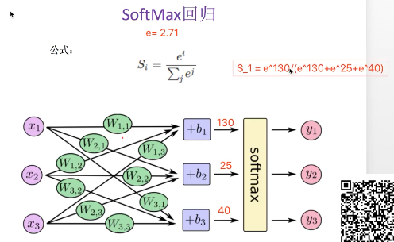

one_hot格式

[0,1,0,0,0,0,0,0,0,0,0,0,0,0,0,0,0,0,0]

交叉熵损失：

衡量softMax结果和真是结果的偏差

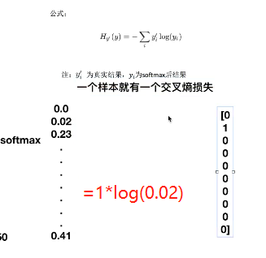


### 深层的神经网络

深度学习网络与更常见的单一隐藏层神经网络的区别在于深度，深度学习网络中，每一个节点层在前一层输出的技术上学习识别一组特定的特征。随着神经网络深度增加，节点所能识别的特征也越来越复杂。(卷积神经网络)

卷积神经网络和人比较判断的比较：

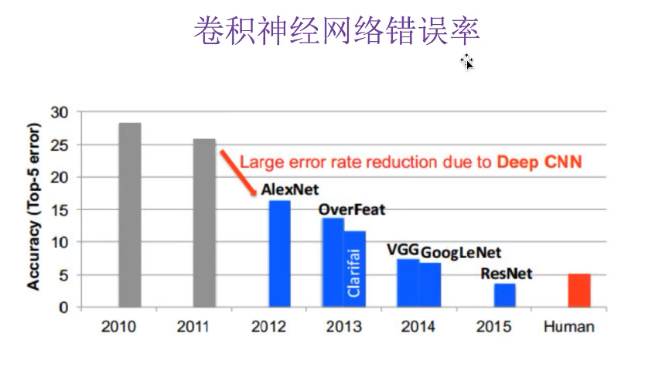

可以看到，到了2015年ResNet判断的准确性已经超过了人类。

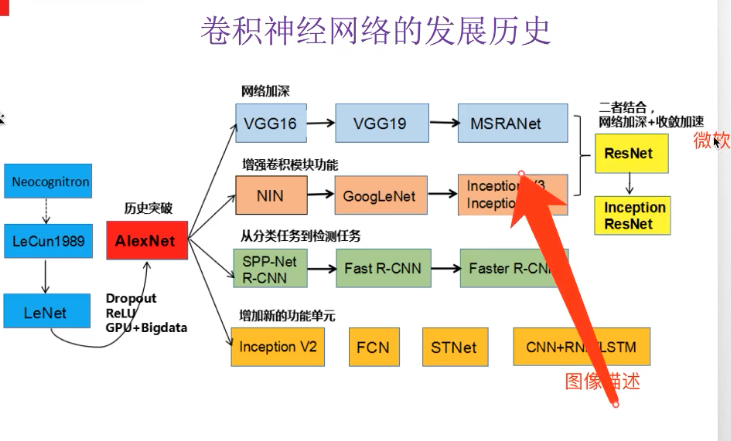

神经网络(neural networks)的基本组成包括输入层、隐藏层、输出层。而卷积神经网络的特点在于隐藏层分为卷积层和池化层(pooling layer,又叫采样层)。

(1)卷积层：通过在原始图像上平移来提取特征

(2)池化层：通过特征后稀疏参数减少学习的参数，降低网络的复杂度(最大池化和平均池化)

卷积改变原始数据的形状，目的是为了减少输入参数，原理如下：

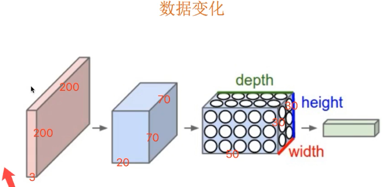

### 卷积神经网络过程

(1)卷积层：定义过滤器(filter观察窗口)大小，步长

大小一般为奇数1*1 ,   3*3,  5*5

步长为1

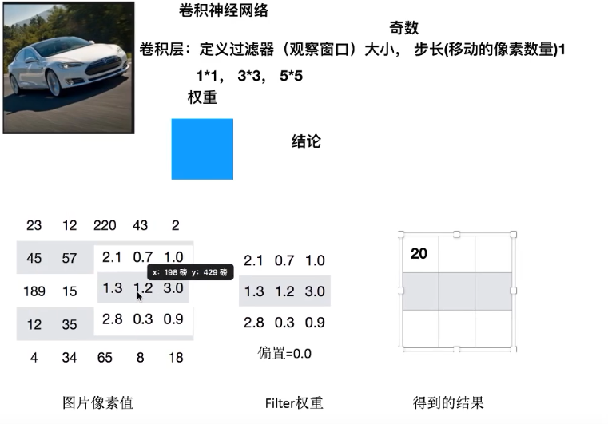

(2)多个filter观察,假设是100张，此时就改变了输入数据的形状

注意：移动越过图片大小：

a.不越过,直接观察，这样会造成数据缺失

b.就直接越过，超过区域加0，称为SAME

因此卷积层有四个参数: filter大小、步长、数量、0填充

(3)彩色图片

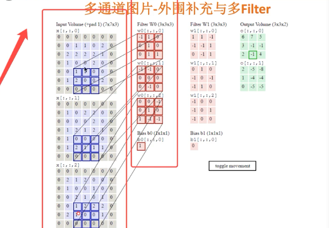

每个观察窗口携带三个filter，对应三相相加，得到一个输出结果。

(3)卷积神经网络参数之间的关系


# 经典库

## numpy

## pandas

## sklearn

## PythonQt(python的桌面应用)

## kivy(python跨平台触摸屏应用，可在手机上运行)

