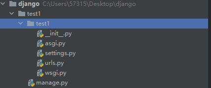
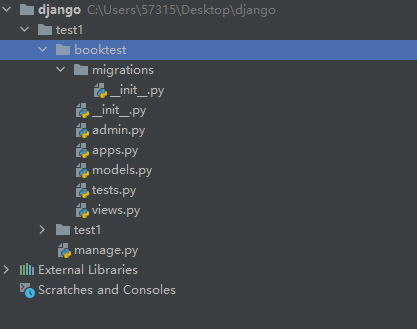
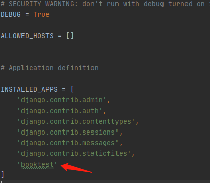

# python

## 基础知识及使用技巧

### python中文编码

解决办法是在文件头添加：

```python
# coding=utf-8
```

### 多行语句

我们使用斜杠(\)将一行的语句分为多行显示

```python
total = item_one + \
        item_two + \
        item_three
```

语句中包含[],{}或()括号就不需要使用多行连接符

```python
days = ['Monday','Tuesday','Wednesday',
'Thursday','Friday']
```

### 用户输入

使用input进行用户输入

```python
name = input("请输入您的姓名：")
print(name)
```

### 命令行参数

使用sys的sys.argv来获取命令行参数，如命令行为

```python
python test.py arg1 arg2 arg3
```

那么sys.argv为

```
['test.py', 'arg1', 'arg2', 'arg3']
```

## Anaconda & pycharm

使用Anaconda Prompt进行环境的切换，使用pycharm创建运行环境。

### Anaconda Prompt查看所有的运行环境

```python
conda info -e
```

### Anaconda Prompt激活某一个运行环境

```python
activate Aol
```

### 使用pycharm创建运行环境

setting–>project–>project interpreter

### 使用豆瓣加速pip安装

```python
pip install sklearn  -i http://pypi.douban.com/simple/ --trusted-host pypi.douban.com
```

### 在deepin安装anaconda

```cmd
#可以去官网下载最新安装包 https://www.anaconda.com/distribution/#linux
wget https://repo.anaconda.com/archive/Anaconda3-2019.10-Linux-x86_64.sh
bash Anaconda3-5.2.0-Linux-x86_64.sh#一路yes即可

source ~/.bashrc #激活安装
conda search "^python$"#指令来查看可用的python版本

#更新
conda update conda
conda update anaconda
#卸载
rm -rf anaconda3 #直接删除anaconda文件夹即可：
```

## 网络编程和多任务

## 数据库

## django

### 创建项目

```python
django-admin startproject test1
```



__init__.py:说明test1是一个python包

settings.py:项目的配置文件

urls.py:进行url路由的配置

wsgi.py:遵循wsgi协议框架，web服务器网关接口，主要针对http风格的请求响应模型做的设计。但不支持websocket。

asgi.py:异步网关协议接口，能够支持http和websocket。

manage.py:整个项目的管理文件。

### 创建功能模块和应用

Django开发中，一个功能模块用一个应用来实现

创建应用：

```python
python manage.py startapp booktest
```



init.py说明目录是一个python模块。

models.py:写和数据库相关的内容。

views.py:定义视图函数。

tests.py:写测试代码的文件。

admin.py:和网站的后台管理相关的文件。

### 注册应用到项目

在项目文件夹test1中settings.py的INSTALLED_APPS变量里注册booktest：



### 启动项目

```python
python manage.py runserver
```

### ORM

缩写Object、Relation、Mapping，描述对象类和数据库中的表之间的映射关系。

### 模型类和表的设计

在**应用**的models.py中设计ORM。例如：

```python
from django.db import models

# Create your models here.
class BookInfo(models.Model):
    #图书名称
    btitle = models.CharField(max_length=20)
    #图书的出版日期
    bpub_date = models.DateField()
```

生成迁移文件，在项目目录下执行

```python
python manage.py makemigrations
```

执行迁移生成数据库表，在项目目录下执行

```python
python manage.py migrate
```

Django默认使用sqlite数据库，在项目文件夹settings里面设置，支持绝大多数数据库。

### 通过模型类操作数据表

django shell可以来实现模型类操作数据表

```python
python manage.py shell
```

创建实例，增加数据，在shell中依次执行

```python
from booktest.models import BookInfo
b = BookInfo()
b.btitle = "天龙八部"
from datetime import date
b.bpub_date = date(1990,1,1)
b.save()
```

执行完毕之后会在数据表中插入“天龙八部”的记录。

查询数据表中的数据，在shell中执行

```python
#查询id=1的记录
br = BookInfo.object.get(id=1)
#输出 booktest.models.BookInfo
type(br)
#输出id=1记录的title
br.btitle
```

修改记录，重新赋值，然后save()

```python
br.bpub_date = date(1991,10,10)
#重新保存
br.save()
```

删除数据，delete()

```python
br.delete()
```

## flask

## tornado

## scrapy

## PythonQt(python的桌面应用)

## numpy

## pandas


## sklearn

## tensorflow

## pytorch

## caffe

## microPython


# C/C++

### deepin安装配置clion

[超链接](https://blog.csdn.net/qq_18352419/article/details/85228159)

# 工具

## deepin

## pycharm

## postman

## EMQ