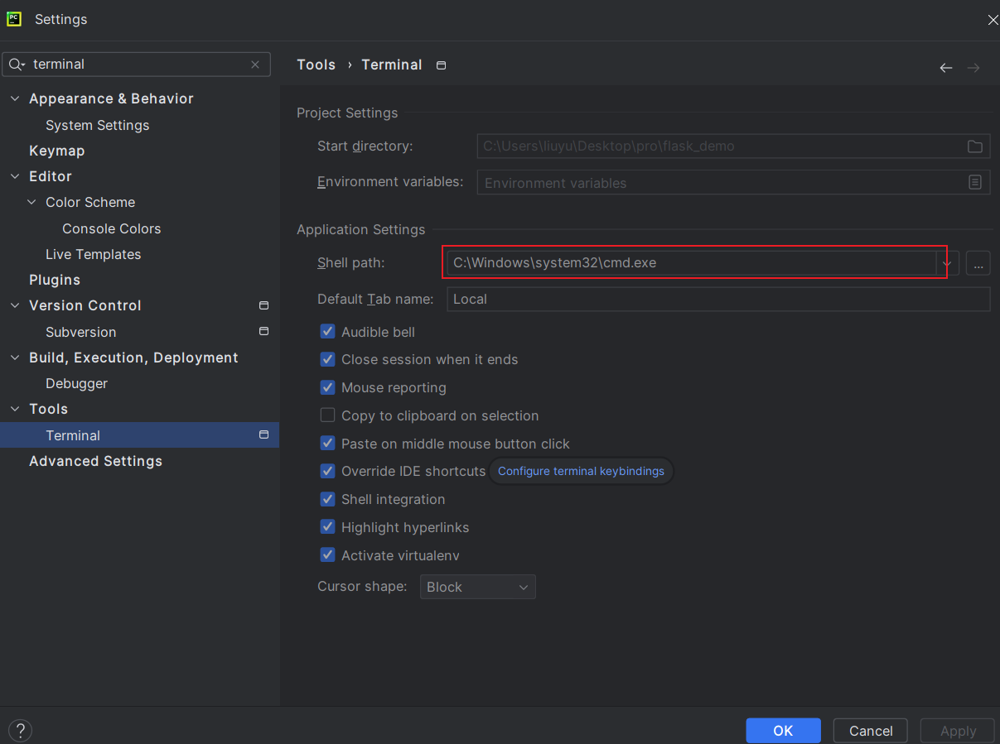
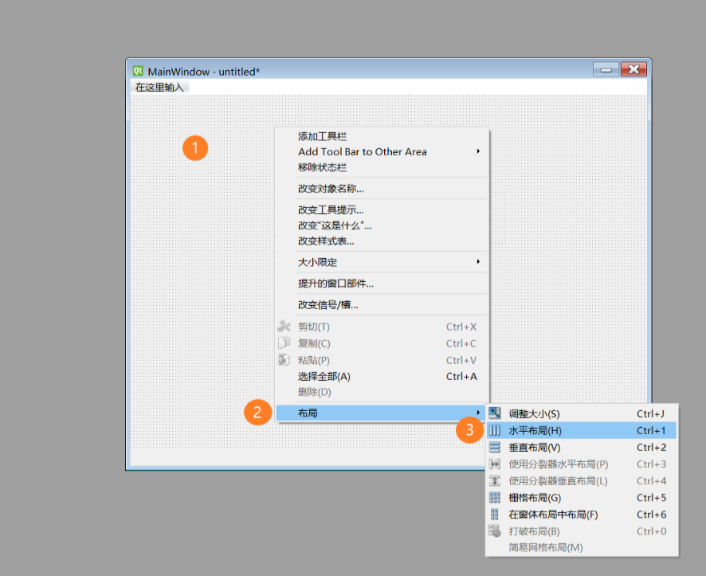
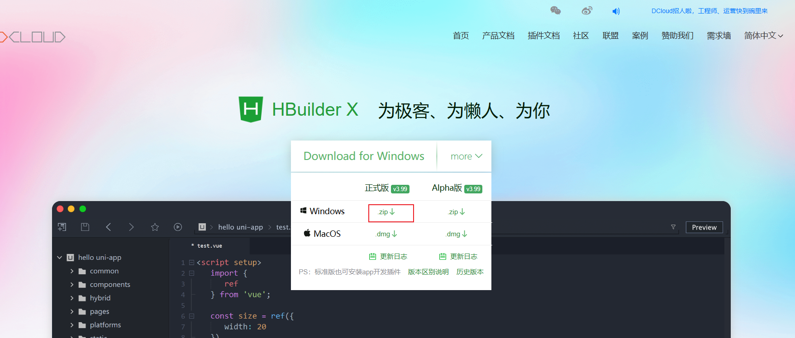
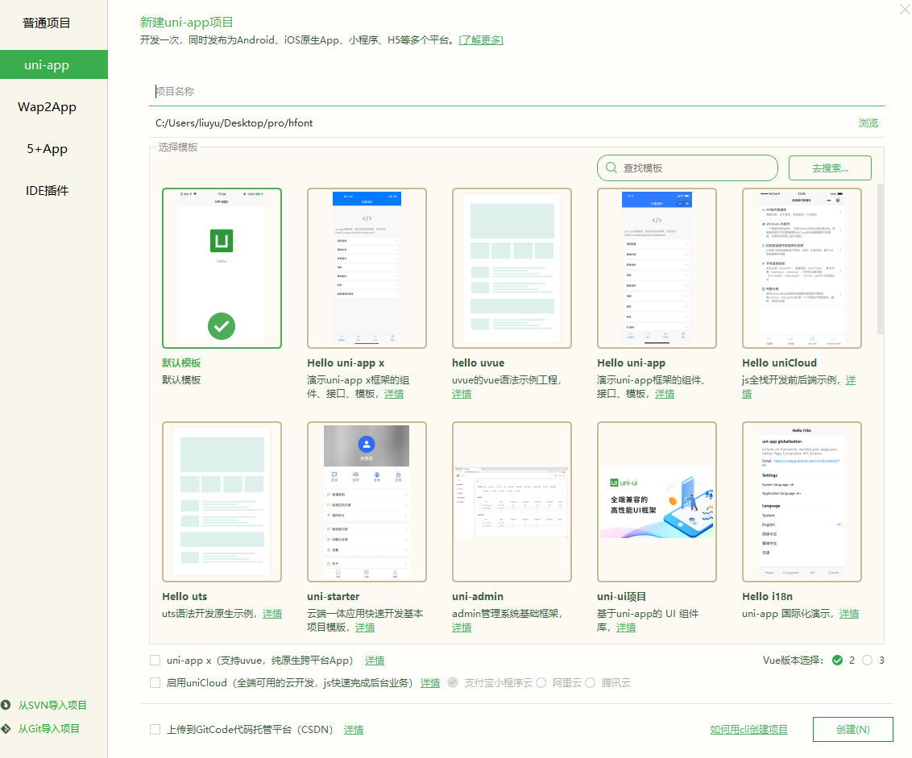

# 柳雨的python知识库

Python是一种高级的、动态类型的编程语言，它以清晰、易读的语法而著名。Python被广泛用于各种领域，包括Web开发、数据科学、人工智能、机器学习、网络爬虫、系统自动化、游戏开发等。

Python具有强大的标准库和丰富的第三方库，这使得Python能够快速开发出复杂的程序。例如，使用Python的NumPy和Pandas库可以轻松地处理大规模的数据集，而使用TensorFlow或PyTorch库则可以进行深度学习。

Python的动态类型特性使得Python更加灵活，但也需要注意可能带来的类型相关错误。Python还有强大的社区支持，使得Python的使用者可以快速找到问题的解决方案。

Python的设计哲学强调的是代码的可读性和简洁性，这使得Python成为一种非常适合初学者的编程语言。Python的语法清晰、简洁，使得Python代码易于阅读和理解。同时，Python也支持多种编程范式，如面向对象编程和函数式编程，这使得Python更加灵活和强大。

总的来说，Python是一种强大、灵活、易读的编程语言，它适用于各种领域和项目。如果你想要快速开发出高质量的程序，或者想要学习一种易于理解和使用的编程语言，那么Python是一个非常好的选择。

## 桌面端开发PySide6

### 使用miniconda安装python环境

（1）.访问[Miniconda — miniconda documentation](https://docs.conda.io/projects/miniconda/en/latest/index.html)，下载windows的最新版本，如下图所示


（2）下载完成后点击安装，一直下一步安装完成。

（3）pycharm社区版选定终端terminal为cmd，设置之后在pycharm内置的terminal中自动带入conda环境。



（4）设置pip的默认仓库地址为清华源，在pycharm的terminal中运行

```
pip config set global.index-url https://pypi.tuna.tsinghua.edu.cn/simple
```

（5）安装pyside6

```
pip install PySide6
```

（6）绑定pyside6的designer到pycharm的外部工具

参考1：[PyCharm下安装配置PySide6开发环境（Qt Designer、PyUIC和PyRCC）_pycharm pyside6-CSDN博客](https://blog.csdn.net/baiydn/article/details/126483010)

参考2：[PyCharm下安装配置PySide6开发环境（Qt Designer(打开，编辑)、PyUIC和PyRCC）_pycharm配置pyside6-CSDN博客](https://blog.csdn.net/mengenqing/article/details/132489529)

（7）设置ui界面自适应大小



## ## 数据库操作

### MySQL

### MongoDb

## Web开发

### Flask

### 前端开发环境

（1）下载node环境，打开node下载官网网址[Node.js (nodejs.org)](https://nodejs.org/en)，下载最新的稳定版node，下一步进行安装。

（2）下载hbuilder，hbuilder是多端开发环境，使用uniapp可以实现一套代码多端复用，打开hbuilder下载，[HBuilderX-高效极客技巧 (dcloud.io)](https://www.dcloud.io/hbuilderx.html)



（3）下载解压之后，发送启动程序到桌面快捷方式，新建项目



(4)设置全局npm的仓库地址为淘宝源

```
npm config set registry  http://registry.npm.taobao.org
```

## 机器学习

## 深度学习

## 行业应用

### PHM

#### 算法模型和算法工程

     算法模型是核心，每一个模型是针对某一特定故障的诊断逻辑，规定了输入数据属性，针对与该种故障返回对应的诊断结果，模型分为固定阈值、动态阈值、趋势预测、机理模型、AI模型、多传感器融合模型，公司拥有工业设备故障50+种的诊断模型，每一个模型均经过理论推导、实验验证和项目验证，具有高准确率。算法工程是算法模型调用的环境和策略，每一种模型的输入数据类型和数据属性是固定的，并且大部分算法模型需要有算法参数输入，并且根据预测对象的不同会设置不同的预测周期，算法工程结合可视化界面关联配置预测对象、传感设备、算法模型、模型参数、调用策略、升级策略等，是算法应用和算法模型之间的桥梁。


### 基于Python的智能硬件

#### micropython

#### pikapython